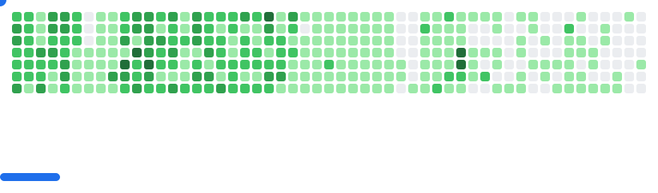

<!-- Badges -->

  

  

  

  

  

<h3 align="center">A passionate mobile app developer from Algeria 🇩🇿</h3>

<h2 align="center">⚒️ Languages - Frameworks - Tools ⚒️</h2> 

  

 

  

 

  

 

  

 

  

 

  

 

  

 

<h2 align="center">⚡ Stats ⚡</h2> 

  
   
  

<h2 align="center">My Contributions</h2>

<picture>
  <source
    media="(prefers-color-scheme: dark)"
    srcset="images/breakout-dark.svg"
  />
  <source
    media="(prefers-color-scheme: light)"
    srcset="images/breakout-light.svg"
  />
  
</picture>

